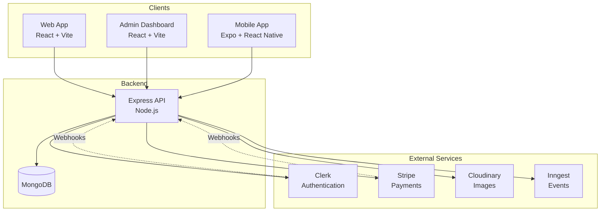
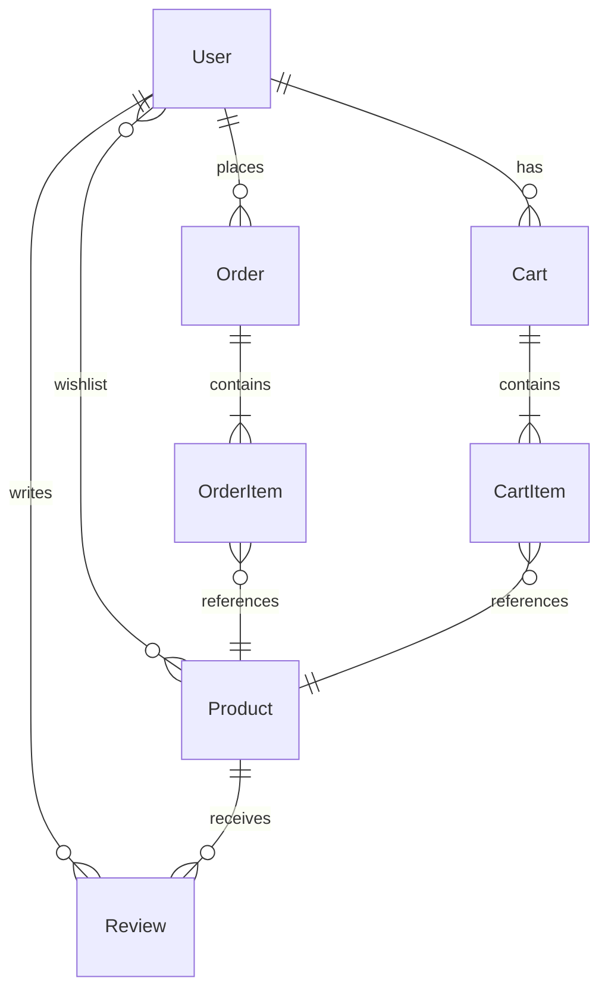

# System Architecture

Don Palito Jr is built as a modern, distributed e-commerce platform with a clear separation between backend services and frontend applications. This architecture enables independent scaling, deployment, and development of each component.

## High-Level Overview



## Core Components

### Backend API (Express + MongoDB)

The backend is a RESTful API built with Express.js that serves as the central hub for all data operations.

#### Technology Stack

- **Express.js v5.2.1**: Web framework handling HTTP requests
- **MongoDB + Mongoose v8.19.3**: Database and object modeling
- **Node.js v20+**: JavaScript runtime (ES Modules)

#### Key Features

- RESTful API endpoints for all resources
- Clerk-based authentication middleware
- File upload handling with Multer
- Event-driven workflows with Inngest
- CORS configured for multi-origin access
- Webhook receivers for Clerk and Stripe

#### Server Configuration

The backend server is configured to handle multiple client origins:

```javascript backend/src/server.js
const corsOptions = {
  origin: ENV.NODE_ENV === "production" 
    ? ENV.CLIENT_URL  
    : function (origin, callback) {
        const allowedOrigins = [
          'http://localhost:5173',           // Admin dashboard
          'http://localhost:5174',           // Web storefront
          'http://localhost:8081',           // Expo metro bundler
          'http://10.0.2.2:3000',           // Android emulator
        ];
        
        // Allow Expo connections
        if (origin.startsWith('exp://')) {
          return callback(null, true);
        }
        
        if (allowedOrigins.includes(origin)) {
          return callback(null, true);
        }
        callback(new Error('Not allowed by CORS'));
      },
  credentials: true,
  methods: ['GET', 'POST', 'PUT', 'DELETE', 'PATCH', 'OPTIONS'],
  allowedHeaders: ['Content-Type', 'Authorization', 'clerk-session-id']
};
```

#### API Routes

The backend exposes the following route groups:

```javascript backend/src/server.js
app.use("/api/admin", adminRoutes);        // Admin operations
app.use("/api/users", userRoutes);        // User management
app.use("/api/orders", orderRoutes);      // Order processing
app.use("/api/reviews", reviewRoutes);    // Product reviews
app.use("/api/products", productRoutes);  // Product catalog
app.use("/api/cart", cartRoutes);         // Shopping cart
app.use("/api/payment", paymentRoutes);   // Payment processing
app.use("/api/coupons", couponRoutes);    // Discount coupons
```

### Admin Dashboard (React + Vite)

A comprehensive admin panel for store management built with React 19 and modern tooling.

#### Technology Stack

- **React v19.2.0**: UI framework
- **Vite v7.2.4**: Build tool and dev server
- **Tailwind CSS v4.1.18**: Utility-first styling
- **DaisyUI v5.5.14**: Component library
- **TanStack Query v5.90.20**: Server state management
- **Zustand v5.0.11**: Client state management
- **React Router v7.13.0**: Navigation
- **Clerk React**: Authentication
- **Axios v1.13.2**: HTTP client
- **Sentry v10.36.0**: Error tracking

#### Main Configuration

```jsx admin/src/main.jsx
const PUBLISHABLE_KEY = import.meta.env.VITE_CLERK_PUBLISHABLE_KEY

const queryClient = new QueryClient({
  defaultOptions: {
    queries: {
      staleTime: 5 * 60 * 1000,        // 5 minutes
      gcTime: 10 * 60 * 1000,          // 10 minutes
      retry: 1,
      refetchOnWindowFocus: false,
      refetchOnMount: true,
      refetchOnReconnect: true,
      networkMode: 'online',
    },
    mutations: {
      retry: 0,
      networkMode: 'online',
    },
  },
})

createRoot(document.getElementById('root')).render(
  <StrictMode>
    <BrowserRouter>
      <ClerkProvider publishableKey={PUBLISHABLE_KEY} localization={esES}>
        <AuthProvider>
          <QueryClientProvider client={queryClient}>
            <App/>
          </QueryClientProvider>
        </AuthProvider>
      </ClerkProvider>
    </BrowserRouter>
  </StrictMode>
)
```

#### Features

- Product catalog management with image uploads
- Order processing and status updates
- Customer management
- Coupon creation and management
- Sales dashboard and analytics
- Real-time data with TanStack Query
- Optimistic updates for better UX

### Web Application (React + Vite)

The customer-facing storefront for browsing and purchasing products.

#### Technology Stack

- **React v18.2.0**: UI framework
- **React Router v6.30.3**: Client-side routing
- **Tailwind CSS v3.4.19**: Styling
- **DaisyUI v4.12.24**: Components
- **Stripe React v5.6.0**: Payment UI
- **TanStack Query v5.90.21**: Data fetching
- **React Hook Form v7.71.1**: Form handling
- **Yup v1.7.1**: Form validation
- **Axios v1.13.5**: HTTP client

#### Application Structure

```jsx web/src/App.jsx
function App() {
  return (
    <ClerkProvider publishableKey={CLERK_KEY} localization={esES}>
      <QueryClientProvider client={queryClient}>
        <AuthProvider>
          <CartProvider>
            <Router>
              <ScrollToTop />
              <Routes>
                {/* Public routes */}
                <Route index element={<Home />} />
                <Route path="catalogo" element={<Catalog />} />
                <Route path="producto/:id" element={<ProductDetail />} />
                
                {/* Protected routes */}
                <Route path="perfil" element={
                  <ProtectedRoute><Profile /></ProtectedRoute>
                } />
                <Route path="checkout" element={
                  <ProtectedRoute><Checkout /></ProtectedRoute>
                } />
              </Routes>
              <CookieBanner />
              <ToastContainer />
            </Router>
          </CartProvider>
        </AuthProvider>
      </QueryClientProvider>
    </ClerkProvider>
  );
}
```

#### Features

- Product browsing with search and filters
- Shopping cart management
- User authentication and profiles
- Order checkout with Stripe
- Order history and tracking
- Wishlist functionality
- Product reviews and ratings
- Responsive design

### Mobile Application (Expo + React Native)

A native mobile shopping experience for iOS and Android.

#### Technology Stack

- **Expo v54.0.33**: React Native framework
- **React Native v0.81.5**: Mobile framework
- **Expo Router v6.0.23**: File-based routing
- **NativeWind v4.2.1**: Tailwind for React Native
- **Clerk Expo v2.19.20**: Mobile authentication
- **Stripe React Native v0.50.3**: Mobile payments
- **TanStack Query v5.90.20**: Data fetching
- **Zustand v5.0.11**: State management
- **Sentry React Native v7.2.0**: Error tracking

#### Features

- Native mobile shopping experience
- Biometric authentication support
- Push notifications (configurable)
- Offline-first cart management
- Mobile-optimized checkout flow
- Camera integration for barcode scanning (extensible)
- Deep linking support

## Data Architecture

### Database Schema

Don Palito Jr uses MongoDB with Mongoose for data modeling. The main collections are:

#### User Model

```javascript backend/src/models/user.model.js
const userSchema = new mongoose.Schema({
  email: {
    type: String,
    required: true,
    unique: true,
  },
  name: {
    type: String,
    required: true,
  },
  clerkId: {
    type: String,
    unique: true,
    required: true,
  },
  stripeCustomerId: {
    type: String,
    default: ""
  },
  addresses: [addressSchema],
  wishlist: [{
    type: mongoose.Schema.Types.ObjectId,
    ref: "Product",
  }],
  isActive: {
    type: Boolean,
    default: true,
  },
  documentType: {
    type: String,
    enum: ["cedula_ciudadania", "cedula_extranjeria", "pasaporte"],
  },
  documentNumber: String,
  phone: String,
}, { timestamps: true });
```

#### Product Model

```javascript backend/src/models/product.model.js
const productSchema = new mongoose.Schema({
  name: {
    type: String,
    required: true
  },
  description: {
    type: String,
    required: true
  },
  price: {
    type: Number,
    required: true,
    min: 0
  },
  stock: {
    type: Number,
    required: true,
    min: 0,
    default: 0
  },
  category: {
    type: String,
    required: true
  },
  images: [{
    type: String,
    required: true
  }],
  averageRating: {
    type: Number,
    min: 0,
    max: 5,
    default: 0
  },
  totalReviews: {
    type: Number,
    min: 0,
    default: 0
  }
}, { timestamps: true });
```

#### Order Model

```javascript backend/src/models/order.model.js
const orderSchema = new mongoose.Schema({
  user: {
    type: mongoose.Schema.Types.ObjectId,
    ref: "User",
    required: true
  },
  clerkId: {
    type: String,
    required: true,
  },
  orderItems: [orderItemSchema],
  shippingAddress: {
    type: shippingAddressSchema,
    required: true
  },
  paymentResult: {
    id: String,
    status: String,
  },
  totalPrice: {
    type: Number,
    required: true,
    min: 0
  },
  status: {
    type: String,
    enum: ["pending", "paid", "in_preparation", "ready", "delivered", "canceled", "rejected"],
    default: "pending"
  },
  paidAt: Date,
  deliveredAt: Date,
}, { timestamps: true });
```

#### Additional Models

- **Cart**: User shopping carts with line items
- **Review**: Product reviews with ratings
- **Coupon**: Discount codes with rules

### Data Relationships



## Authentication Flow

Don Palito Jr uses Clerk for authentication across all platforms.

### How It Works

<Steps>

### User Signs Up/Logs In

User interacts with Clerk's UI components in any client application (web, admin, or mobile).

### Clerk Issues Token

Clerk handles authentication and issues a JWT token to the client.

### Client Sends Token

Client includes the token in the `Authorization` header for all API requests:

```javascript
Authorization: Bearer <clerk_jwt_token>
```

### Backend Validates Token

The Express backend uses Clerk middleware to validate tokens:

```javascript backend/src/server.js
import { clerkMiddleware } from '@clerk/express';

app.use(clerkMiddleware());
```

### Webhook Synchronization

When users are created, updated, or deleted in Clerk, webhooks notify the backend:

```javascript backend/src/server.js
app.post("/api/webhooks/clerk", async (req, res) => {
  const event = req.body;
  
  // Send to Inngest for processing
  await inngest.send({
    name: `clerk.${event.type}`,
    data: event.data,
  });
  
  res.status(200).json({ received: true });
});
```

### User Created in Database

Inngest processes the webhook and creates/updates the user in MongoDB, linking the Clerk ID to the database record.

</Steps>

### Protected Routes

Authentication is enforced at multiple levels:

**Backend**: Middleware checks for valid Clerk session

```javascript backend/src/middleware/auth.middleware.js
export const requireAuth = async (req, res, next) => {
  const { userId } = req.auth;
  if (!userId) {
    return res.status(401).json({ message: "Unauthorized" });
  }
  next();
};
```

**Frontend**: Route guards prevent unauthorized access

```jsx web/src/components/auth/ProtectedRoute.jsx
const ProtectedRoute = ({ children }) => {
  const { isSignedIn, isLoaded } = useAuth();
  
  if (!isLoaded) return <PageLoader />;
  if (!isSignedIn) return <Navigate to="/login" />;
  
  return children;
};
```

## Payment Processing Flow

Payments are handled through Stripe integration.

### Checkout Process

<Steps>

### User Initiates Checkout

User proceeds to checkout with items in cart.

### Create Payment Intent

Frontend requests a payment intent from the backend:

```javascript
POST /api/payment/create-payment-intent
{
  "amount": 5000,
  "currency": "usd"
}
```

### Backend Creates Stripe Intent

Backend creates a Stripe PaymentIntent and returns the client secret.

### User Completes Payment

User enters payment details using Stripe Elements (web) or Stripe SDK (mobile). Stripe processes the payment securely.

### Stripe Sends Webhook

On payment success, Stripe sends a webhook to:

```
POST /api/payment/webhook
```

### Backend Processes Webhook

Backend verifies the webhook signature and updates the order:

```javascript
// Verify signature
const signature = req.headers['stripe-signature'];
const event = stripe.webhooks.constructEvent(
  req.body,
  signature,
  process.env.STRIPE_WEBHOOK_SECRET
);

// Handle payment success
if (event.type === 'payment_intent.succeeded') {
  await Order.findByIdAndUpdate(orderId, {
    status: 'paid',
    paidAt: new Date(),
    'paymentResult.status': 'succeeded'
  });
}
```

### Order Confirmed

User receives confirmation and order status is updated to "paid".

</Steps>

### Supported Payment Methods

- Credit/debit cards
- Digital wallets (Apple Pay, Google Pay)
- Bank transfers (via Stripe)
- Local payment methods (configurable per region)

## Event-Driven Architecture

Don Palito Jr uses Inngest for event-driven workflows.

### Key Events

- **clerk.user.created**: New user registration
- **clerk.user.updated**: User profile updates
- **clerk.user.deleted**: User account deletion
- **order.created**: New order placed
- **order.paid**: Payment confirmed
- **order.shipped**: Order dispatched

### Example: User Creation Flow

```javascript backend/src/config/inngest.js
import { Inngest } from "inngest";

const inngest = new Inngest({ id: "don-palito-jr" });

const createUserFunction = inngest.createFunction(
  { id: "create-user" },
  { event: "clerk.user.created" },
  async ({ event }) => {
    const { id, email_addresses, first_name, last_name, image_url } = event.data;
    
    await User.create({
      clerkId: id,
      email: email_addresses[0].email_address,
      name: `${first_name} ${last_name}`,
      imageUrl: image_url,
    });
    
    // Send welcome email
    await sendWelcomeEmail(email_addresses[0].email_address);
  }
);
```

## Image Management

Cloudinary handles all image storage and optimization.

### Upload Flow

1. Admin uploads image via multipart form
2. Multer middleware processes the file
3. Backend uploads to Cloudinary
4. Cloudinary returns optimized image URLs
5. URLs stored in MongoDB product record

### Benefits

- Automatic image optimization
- CDN delivery for fast loading
- Responsive images with transformations
- Format conversion (WebP, AVIF)
- Lazy loading support

## Deployment Architecture

### Production Configuration

In production mode, the backend serves the admin dashboard as static files:

```javascript backend/src/server.js
if (ENV.NODE_ENV === "production") {
  app.use(express.static(path.join(__dirname, "../admin/dist")));
  app.get("/{*any}", (req, res) => {
    res.sendFile(path.join(__dirname, "../admin", "dist", "index.html"));
  });
}
```

### Recommended Deployment

- **Backend + Admin**: Deploy together on platforms like Railway, Render, or Heroku
- **Web App**: Deploy separately on Vercel, Netlify, or Cloudflare Pages
- **Mobile App**: Publish to App Store and Google Play using Expo EAS
- **Database**: MongoDB Atlas (managed cluster)

## Technology Choices & Rationale

### Why Express.js?

- Mature, battle-tested framework
- Excellent middleware ecosystem
- Easy integration with Clerk and Stripe
- Great performance for REST APIs

### Why MongoDB?

- Flexible schema for evolving product requirements
- Excellent Node.js integration with Mongoose
- Horizontal scaling capabilities
- Rich query language

### Why React?

- Component-based architecture for reusability
- Large ecosystem and community
- Excellent developer experience
- Server-side rendering support (future enhancement)

### Why Expo?

- Simplified React Native development
- Over-the-air updates
- Managed build service (EAS)
- Rich set of native modules

### Why Clerk?

- Drop-in authentication solution
- Multi-platform SDK support
- User management UI
- Social login integration
- Webhook-based synchronization

### Why Stripe?

- Industry-standard payment processing
- Excellent developer experience
- Strong security and compliance
- Rich feature set (subscriptions, invoices, etc.)
- Global payment method support

### Why Inngest?

- Reliable event processing
- Built-in retries and error handling
- Easy local development
- Visibility into workflow execution

## Performance Considerations

### Backend Optimizations

- MongoDB indexes on frequently queried fields
- Connection pooling for database
- CORS configured to allow specific origins only
- Gzip compression for responses
- Rate limiting on sensitive endpoints (configurable)

### Frontend Optimizations

- Code splitting with React lazy loading
- TanStack Query caching (5-minute stale time)
- Image lazy loading
- Optimistic updates for better UX
- Service worker for PWA capabilities (web)

### Mobile Optimizations

- Expo optimized production builds
- Image caching with expo-image
- React Native performance monitoring
- Minimized bundle size

## Security Best Practices

- Environment variables for all secrets
- HTTPS enforced in production
- CORS properly configured
- Webhook signature verification
- SQL injection prevention via Mongoose
- XSS protection with React's default escaping
- CSRF tokens for state-changing operations
- Regular dependency updates
- Sentry for error monitoring

## Next Steps

Now that you understand the architecture:

- Explore individual component documentation
- Learn about the API endpoints in detail
- Understand the database models and relationships
- Customize the system to fit your needs
- Deploy to production
