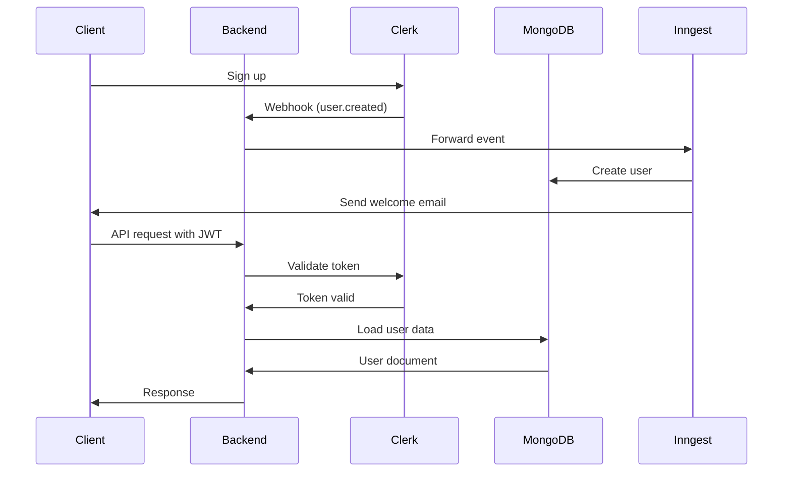

## Overview

The backend uses [Clerk](https://clerk.com) for authentication, providing secure user management with JWT tokens and webhooks.

## Clerk Setup

<Steps>
  <Step title="Create Clerk Account">
    Sign up at [clerk.com](https://clerk.com) and create a new application
  </Step>
  
  <Step title="Get API Keys">
    From the Clerk dashboard, copy:
    - Publishable Key (starts with `pk_test_` or `pk_live_`)
    - Secret Key (starts with `sk_test_` or `sk_live_`)
  </Step>
  
  <Step title="Configure Environment">
    Add keys to your `.env` file:
    ```bash
    CLERK_PUBLISHABLE_KEY=pk_test_...
    CLERK_SECRET_KEY=sk_test_...
    CLERK_WEBHOOK_SECRET=whsec_...
    ```
  </Step>
  
  <Step title="Set Up Webhooks">
    Configure webhook endpoint at `/api/webhooks/clerk` to receive user events
  </Step>
</Steps>

## Clerk Middleware

The Clerk middleware is applied globally to all routes.

```javascript src/server.js:94
app.use(clerkMiddleware());
```

This makes authentication information available via `req.auth()` on all requests.

<Note>
  The `clerkMiddleware()` does not block unauthenticated requests. Use `protectRoute` middleware to require authentication.
</Note>

## Protected Routes

The `protectRoute` middleware ensures users are authenticated and loads their data from the database.

### Implementation

```javascript src/middleware/auth.middleware.js:5-37
export const protectRoute = [
    requireAuth(),
    async (req, res, next) => {
        try {
            const auth = req.auth();
            const clerkId = auth.userId;

            if (!clerkId) {
                return res.status(401).json({ 
                    message: "Unauthorized - Invalid token" 
                });
            }

            const user = await User.findOne({ clerkId });
            
            if (!user) {
                return res.status(404).json({ 
                    message: "User not found" 
                });
            }

            req.user = user;
            req.clerkAuth = auth;
            
            next();
        } catch (error) {
            console.error("Error in protectRoute middleware:", error);
            return res.status(500).json({ 
                message: "Internal server error" 
            });
        }
    }
];
```

### How It Works

<Steps>
  <Step title="Require Authentication">
    `requireAuth()` from `@clerk/express` validates the JWT token
  </Step>
  
  <Step title="Extract User ID">
    Gets `clerkId` from the authenticated session
  </Step>
  
  <Step title="Load User Data">
    Queries MongoDB for the user record
  </Step>
  
  <Step title="Attach to Request">
    Adds `req.user` (database user) and `req.clerkAuth` (Clerk auth data) for use in route handlers
  </Step>
</Steps>

### Usage Example

```javascript
import { protectRoute } from '../middleware/auth.middleware.js';

router.get('/profile', protectRoute, async (req, res) => {
    // req.user contains the MongoDB user document
    // req.clerkAuth contains Clerk authentication data
    res.json({ user: req.user });
});
```

## Admin Authorization

The `adminOnly` middleware restricts routes to admin users.

### Implementation

```javascript src/middleware/auth.middleware.js:39-92
export const adminOnly = async (req, res, next) => {
    try {
        if (!req.user || !req.clerkAuth) {
            console.error("adminOnly: protectRoute no se ejecutó primero");
            return res.status(401).json({ 
                message: "Unauthorized - authentication required" 
            });
        }

        const userRole = req.clerkAuth.sessionClaims?.role;
        const userEmail = req.user.email;

        if (ENV.NODE_ENV === 'development') {
            console.log(`Admin check:`, {
                email: userEmail,
                role: userRole || 'sin role',
                clerkId: req.user.clerkId
            });
        }

        const isAdmin = userRole === 'admin';
        
        const isAdminByEmail = ENV.NODE_ENV === 'development' &&
                                ENV.ADMIN_EMAIL && 
                                ENV.ADMIN_EMAIL.split(',')
                                    .map(e => e.trim())
                                    .includes(userEmail);

        if (!isAdmin && !isAdminByEmail) {
            if (ENV.NODE_ENV === 'development') {
                console.log(`Acceso denegado:`, {
                    email: userEmail,
                    role: userRole || 'sin rol'
                });
            }        
            return res.status(403).json({ 
                message: "Forbidden - admin access only",
                details: ENV.NODE_ENV === 'development' 
                    ? `Rol actual: ${userRole || 'ninguno'}` 
                    : undefined
            });
        }

        if (ENV.NODE_ENV === 'development') {
            console.log(`Admin autorizado: ${userEmail} (${isAdmin ? 'por rol' : 'por email'})`);
        }
        next();
    } catch (error) {
        console.error("Error in adminOnly middleware:", error);
        return res.status(500).json({ 
            message: "Internal server error" 
        });
    }
};
```

### Admin Authorization Methods

<Accordion title="By Role (Production & Development)">
  The user's Clerk session must have `role: 'admin'` in session claims.
  
  Set this in Clerk dashboard under User Metadata or via API.
</Accordion>

<Accordion title="By Email (Development Only)">
  In development, you can specify admin emails in `.env`:
  
  ```bash
  ADMIN_EMAIL=admin@example.com,admin2@example.com
  ```
  
  This allows testing without configuring Clerk roles.
</Accordion>

### Usage Example

```javascript
import { protectRoute, adminOnly } from '../middleware/auth.middleware.js';

// Admin-only route
router.post('/products', protectRoute, adminOnly, async (req, res) => {
    // Only admins can create products
    const product = await Product.create(req.body);
    res.json(product);
});
```

<Warning>
  Always use `protectRoute` before `adminOnly`. The admin middleware depends on `req.user` and `req.clerkAuth` being set.
</Warning>

## Role-Based Authorization

The `requireRole` middleware allows custom role checking.

### Implementation

```javascript src/middleware/auth.middleware.js:94-119
export const requireRole = (allowedRoles) => {
    return async (req, res, next) => {
        try {
            if (!req.clerkAuth) {
                return res.status(401).json({ 
                    message: "Unauthorized - authentication required" 
                });
            }

            const userRole = req.clerkAuth.sessionClaims?.role;

            if (!allowedRoles.includes(userRole)) {
                return res.status(403).json({ 
                    message: "Forbidden - insufficient permissions"
                });
            }

            next();
        } catch (error) {
            console.error("Error in requireRole middleware:", error);
            return res.status(500).json({ 
                message: "Internal server error" 
            });
        }
    };
};
```

### Usage Example

```javascript
import { protectRoute, requireRole } from '../middleware/auth.middleware.js';

// Allow both admin and moderator
router.put('/products/:id', 
    protectRoute, 
    requireRole(['admin', 'moderator']), 
    async (req, res) => {
        // Update product
    }
);
```

## Webhook Handling

Clerk webhooks sync user data between Clerk and MongoDB.

### Webhook Endpoint

```javascript src/server.js:75-90
app.post("/api/webhooks/clerk", async (req, res) => {
  const event = req.body;

  console.log("Webhook received:", event.type);

  try {
    await inngest.send({
      name: `clerk.${event.type}`,
      data: event.data,
    });
    res.status(200).json({ received: true });
  } catch (error) {
    console.error("Error sending event to Inngest:", error);
    res.status(500).json({ error: "Inngest error" });
  }
});
```

### Webhook Events

The webhook forwards events to Inngest for processing:

<CodeGroup>
```javascript user.created
// Inngest function creates user in MongoDB
// See src/config/inngest.js:10-35

const syncUser = inngest.createFunction(
    {id: "sync-user"},
    {event:"clerk.user.created"},
    async ({event}) => {
        await connectDB();
        const {id, email_addresses, first_name, last_name, image_url} = event.data;
        const newUser = {
            clerkId: id,
            email: email_addresses[0]?.email_address,
            name: `${first_name || ""} ${last_name || ""}` || "Usuario",
            imageUrl: image_url,
            address: [],
            wishlist: [],
        };
        await User.create(newUser);
        
        sendWelcomeEmail({
            userName: `${first_name || ""} ${last_name || ""}`.trim() || "Usuario",
            userEmail: email_addresses[0]?.email_address,
        });
    }
);
```

```javascript user.deleted
// Inngest function deletes user from MongoDB
// See src/config/inngest.js:37-50

const deleteUserFromDB = inngest.createFunction(
    {id: "delete-user-from-db"},
    {event:"clerk.user.deleted"},
    async ({event}) => {
        await connectDB();
        const {id} = event.data;
        await User.deleteOne({clerkId: id});
    }
);
```
</CodeGroup>

### Configure Clerk Webhook

<Steps>
  <Step title="Go to Clerk Dashboard">
    Navigate to Webhooks section
  </Step>
  
  <Step title="Add Endpoint">
    Add endpoint URL: `https://your-domain.com/api/webhooks/clerk`
    
    For development, use ngrok or Clerk's webhook forwarding
  </Step>
  
  <Step title="Select Events">
    Subscribe to:
    - `user.created`
    - `user.deleted`
  </Step>
  
  <Step title="Copy Signing Secret">
    Save the webhook signing secret to `.env`:
    ```bash
    CLERK_WEBHOOK_SECRET=whsec_...
    ```
  </Step>
</Steps>

<Note>
  The webhook endpoint does not verify signatures in this implementation. For production, add signature verification using `@clerk/clerk-sdk-node`.
</Note>

## Authentication Flow



## User Roles

The system supports the following roles:

| Role | Description | Access |
|------|-------------|--------|
| `admin` | Administrator | Full access to all endpoints |
| `moderator` | Moderator | Custom permissions via `requireRole` |
| `user` | Regular user | Standard authenticated endpoints |

### Setting User Roles

Roles are set in Clerk's session claims. You can set them:

1. **Via Clerk Dashboard**: User metadata → Public metadata
2. **Via Clerk API**: Update user metadata programmatically

```json Clerk Public Metadata
{
  "role": "admin"
}
```

<Tip>
  For development, use the `ADMIN_EMAIL` environment variable to grant admin access without configuring Clerk roles.
</Tip>

## Security Best Practices

<Warning>
  - Never expose `CLERK_SECRET_KEY` in client-side code
  - Always validate webhook signatures in production
  - Use HTTPS for all production endpoints
  - Rotate API keys regularly
  - Use separate Clerk applications for development and production
</Warning>

### JWT Token Validation

Clerk's `requireAuth()` middleware automatically:
- Validates JWT signature
- Checks token expiration
- Verifies issuer and audience

### Session Claims

Access custom session data:

```javascript
const auth = req.auth();
const userId = auth.userId;           // Clerk user ID
const sessionId = auth.sessionId;     // Session ID
const role = auth.sessionClaims?.role; // Custom role
```

## Protected Route Examples

### User Profile Route

```javascript
router.get('/profile', protectRoute, async (req, res) => {
    res.json({ user: req.user });
});
```

### Admin Product Creation

```javascript
router.post('/products', protectRoute, adminOnly, async (req, res) => {
    const product = await Product.create(req.body);
    res.json(product);
});
```

### Multi-Role Access

```javascript
router.patch('/orders/:id', 
    protectRoute, 
    requireRole(['admin', 'moderator']),
    async (req, res) => {
        const order = await Order.findByIdAndUpdate(
            req.params.id,
            { status: req.body.status },
            { new: true }
        );
        res.json(order);
    }
);
```

## Troubleshooting

<Accordion title="401 Unauthorized - Invalid token">
  **Cause**: JWT token is missing, expired, or invalid
  
  **Solution**:
  - Ensure client sends token in Authorization header
  - Check token hasn't expired
  - Verify `CLERK_SECRET_KEY` matches your Clerk application
</Accordion>

<Accordion title="404 User not found">
  **Cause**: User exists in Clerk but not in MongoDB
  
  **Solution**:
  - Check webhook is configured correctly
  - Manually trigger `sync-user` Inngest function
  - Verify MongoDB connection
</Accordion>

<Accordion title="403 Forbidden - admin access only">
  **Cause**: User doesn't have admin role
  
  **Solution**:
  - Set `role: 'admin'` in Clerk public metadata
  - Or add email to `ADMIN_EMAIL` in development
</Accordion>